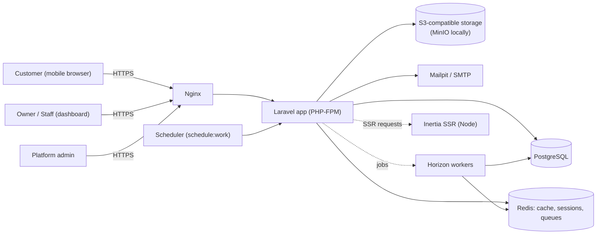
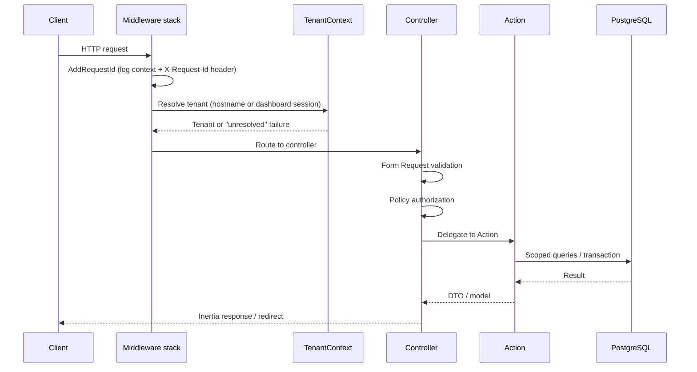
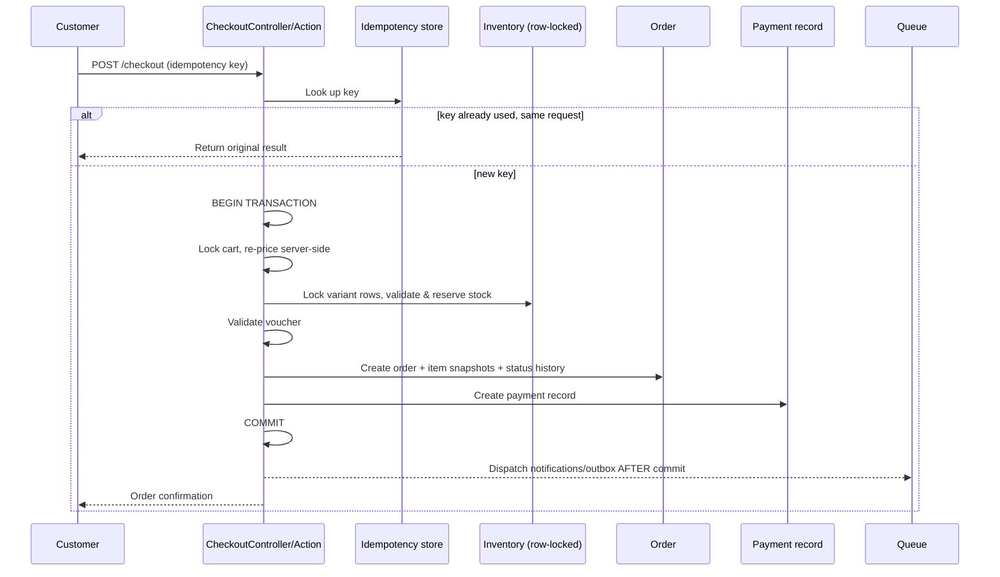
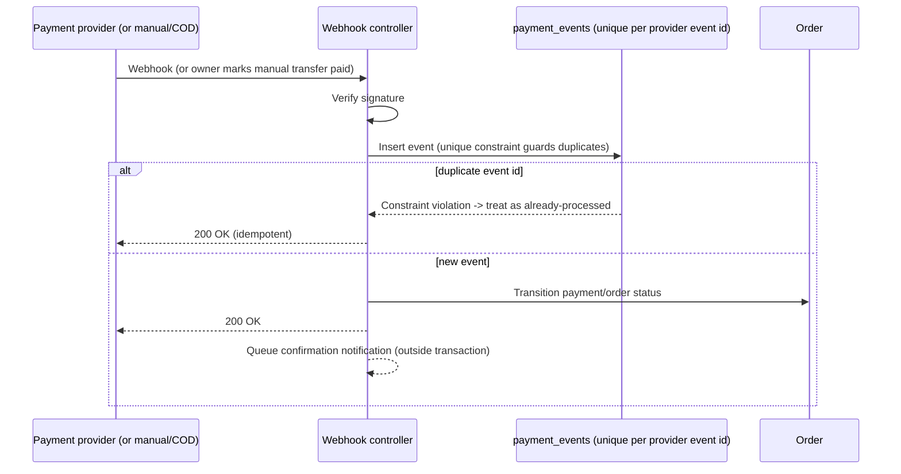

# Architecture

## 1. System Context



One Laravel application serves every tenant. There is no per-tenant
deployment, database, or schema — see `docs/TENANCY.md`.

## 2. Modular Monolith

The codebase is a single Laravel deployable, organized by feature module
rather than by technical layer alone. There are no microservices and no
per-module HTTP boundary — modules talk to each other in-process via the
service container, events, and Eloquent relationships.

```text
app/
├── Actions/{Auth,Tenancy,Store,Catalog,Inventory,Checkout,Order,Payment,Shipping,Voucher,Analytics}/
├── Contracts/{Payments,Shipping,Tenancy}/
├── Data/{Catalog,Checkout,Payment,Shipping}/      # DTOs crossing module boundaries
├── Enums/                                          # finite states (order status, payment status, ...)
├── Http/Controllers/{Auth,Dashboard,Storefront,PlatformAdmin,Webhooks}/
├── Models/
├── Policies/
├── Services/{Payments,Shipping,Storage}/
└── Support/{Money,Tenancy,Idempotency}/
```

**Module responsibilities**

| Module | Responsibility |
|---|---|
| Tenancy | Resolve the current tenant (hostname or dashboard session), enforce isolation |
| Store | Store profile, branding, domains, fulfillment settings |
| Catalog | Categories, products, options, variants, images |
| Inventory | On-hand/reserved stock, movement ledger, reservation locking |
| Checkout | Cart pricing, idempotent order creation, inventory reservation |
| Order | Order lifecycle, status history, snapshots |
| Payment | `PaymentGateway` contract + manual/COD/fake adapters, webhook handling |
| Shipping | `ShippingProvider` contract + pickup/flat/zone adapters |
| Voucher | Discount validation and application inside the checkout transaction |
| Analytics | Tenant-scoped aggregate dashboard queries |

Controllers stay thin: they validate via Form Requests, authorize via
Policies, and delegate business logic to single-purpose Action classes.
Repository interfaces are only introduced where there are genuinely multiple
persistence implementations (payments, shipping) — ordinary CRUD uses scoped
Eloquent queries directly.

## 3. Request Lifecycle



## 4. Checkout Flow



Nothing that talks to the network (notifications, webhooks-out) happens
inside the transaction — see `docs/DATABASE.md` for the reservation model and
`docs/DECISIONS.md` for why.

## 5. Payment Flow



## 6. Queue Flow

Redis-backed queues via Laravel Horizon. Queues: `high`, `payments`,
`notifications`, `default`, `low`. Jobs that depend on data committed in the
current request are always dispatched **after** the transaction commits
(`DB::afterCommit()` / `dispatch()->afterCommit()` semantics), never from
inside it.

## 7. Storage Flow

Uploads (store logo/banner, product images) go through Laravel's Filesystem
abstraction to an S3-compatible disk (MinIO locally, a real bucket in
production). Paths are tenant-prefixed; filenames are randomly generated,
never derived from user input. Public assets use public object URLs; private
assets use signed/temporary URLs.

## 8. Architectural Boundaries

- **Tenant boundary**: enforced in the database (`tenant_id` on every
  tenant-owned table + unique constraints scoped by `tenant_id`), in
  `TenantContext`, in scoped Eloquent queries, and in Policies — defense in
  depth, not any single layer. See `docs/TENANCY.md`.
- **Payment/shipping boundary**: order-domain code depends only on
  `App\Contracts\Payments\PaymentGateway` and
  `App\Contracts\Shipping\ShippingProvider`; concrete providers live in
  `App\Services\Payments` / `App\Services\Shipping` and are swapped via
  config (`PAYMENT_DRIVER`, `SHIPPING_DRIVER`), never referenced directly
  from Actions.
- **Money boundary**: monetary values are integer Rupiah end to end; a
  `Money` value object in `App\Support\Money` is the only place arithmetic on
  money happens.
