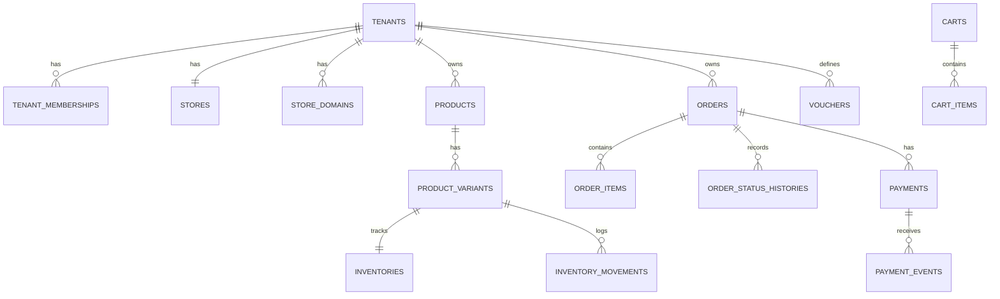

# Database Design

Status: design reference for phases 1–6. Phase 0 has only shipped the
starter kit's `users`/`sessions`/`cache`/`jobs` tables — everything below is
implemented incrementally; `docs/PROGRESS.md` tracks what actually exists at
any point in time.

## 1. Conventions

- PostgreSQL, via Laravel migrations/schema builder; raw SQL only where a
  Postgres-specific feature (check constraints, `FOR UPDATE`) has no builder
  equivalent.
- Public identifiers are ULIDs, never sequential integers (see below).
- Money is always an integer column (Rupiah, no decimals) — never `float`.
- Every tenant-owned table carries a non-null `tenant_id` foreign key.
- Enums are represented as PHP backed enums mapped to a `string` column
  (portable, indexable, no Postgres `ENUM` migration pain) unless a `CHECK`
  constraint duplicates the valid set for defense in depth at the DB layer.

## 2. Tables

| Table | Purpose |
|---|---|
| `users` | Platform login (owner/staff/platform_admin) |
| `social_accounts` | Google Socialite identities linked to a `user` by verified email |
| `tenants` | One row per business; slug is the subdomain |
| `tenant_memberships` | user ↔ tenant, with a role (`owner`, `staff`) |
| `stores` | Storefront profile/branding/fulfillment settings, 1:1 with tenant |
| `store_domains` | Subdomain + verified custom domains for a tenant |
| `categories` | Tenant-scoped product categories |
| `products` | Tenant-scoped catalog entries (draft/active/archived) |
| `product_images` | Ordered images per product |
| `product_options` / `product_option_values` | e.g. "Size" → {S, M, L} |
| `product_variants` | Sellable SKU: price, sale price, weight, option values |
| `inventories` | `on_hand` / `reserved` per variant |
| `inventory_movements` | Append-only ledger of every stock change |
| `stock_reservations` | Reservation held during checkout, released on expiry/cancel |
| `carts` / `cart_items` | Guest cart, tenant-scoped, opaque token |
| `customers` / `customer_addresses` | Created/updated at checkout, no login required |
| `orders` | Order header: status, payment status, fulfillment status, totals |
| `order_items` | Immutable product/variant snapshot at order time |
| `order_status_histories` | Every status transition, with actor when applicable |
| `payments` | One payment record per order (can be re-attempted) |
| `payment_events` | Raw webhook/event log, unique per provider event |
| `shipping_methods` / `shipping_zones` / `shipping_zone_rates` | Tenant-configured shipping |
| `shipments` | Tracking number/carrier/status once an order ships |
| `vouchers` / `voucher_usages` | Discount codes, tenant-scoped uniqueness, usage tracking |
| `idempotency_keys` | Checkout idempotency: key + request fingerprint + result |
| `audit_logs` | Sensitive action trail (suspensions, price/inventory/payment changes) |
| `outbox_events` | Transactional outbox for cross-boundary events (see `docs/DECISIONS.md`) |

## 3. Key Relationships



## 4. Unique Constraints

```text
UNIQUE tenants.slug
UNIQUE store_domains.hostname
UNIQUE categories(tenant_id, slug)
UNIQUE products(tenant_id, slug)
UNIQUE product_variants(tenant_id, sku)
UNIQUE vouchers(tenant_id, code)
UNIQUE payment_events(provider, external_event_id)
UNIQUE idempotency_keys(tenant_id, key)
```

These are database-level, not just application-level validation: they are
the last line of defense against a race condition producing two rows that
should have been rejected as duplicates (e.g. two concurrent webhook
deliveries for the same provider event).

## 5. Indexing Strategy

Indexes are added for the query patterns the app actually issues (list by
tenant + status, dashboard date-range aggregates), not speculatively:

```text
products(tenant_id, status)
products(tenant_id, category_id, status)
orders(tenant_id, created_at)
orders(tenant_id, status, created_at)
orders(tenant_id, payment_status, created_at)
inventory_movements(tenant_id, product_variant_id, created_at)
carts(tenant_id, token)
customers(tenant_id, phone)
```

## 6. Money Representation

All monetary columns are `bigInteger`, storing whole Rupiah (`Rp15.000` is
stored as `15000`). No column ever stores a fraction of a Rupiah. Arithmetic
happens through `App\Support\Money\Money`, never raw `+`/`-` on floats.
Non-negative check constraints are added on monetary columns where negative
would be a data-integrity bug (prices, totals) — not on columns where a
negative delta is meaningful (inventory movement deltas).

## 7. Tenant Isolation Strategy

Shared database, shared schema. See `docs/TENANCY.md` for the full
defense-in-depth model; at the schema level this means:

1. Every tenant-owned table has a non-null `tenant_id`.
2. Composite unique constraints include `tenant_id` (a slug is unique
   *within* a tenant, not globally).
3. No table relies on the *absence* of a `tenant_id` filter for correctness
   — every tenant-scoped Eloquent query applies an explicit `tenant_id`
   constraint rather than trusting a global scope alone (global scopes are
   used too, as a second layer, not a replacement).

## 8. Inventory Reservation Model

```text
available = on_hand - reserved
```

- `inventories.on_hand` changes only through `inventory_movements` rows
  (restock, manual adjustment, sale, return).
- `inventories.reserved` increases when checkout reserves stock and
  decreases when the reservation is released (order paid → converted to a
  sale; order expired/cancelled → released back to available).
- Reservation during checkout uses `SELECT ... FOR UPDATE` (Eloquent's
  `lockForUpdate()`) on the variant's inventory row inside the checkout
  transaction, so two concurrent checkouts for the last unit cannot both
  succeed.
- `stock_reservations` rows record the reservation itself (order, variant,
  quantity, expiry) so a scheduled job can find and release expired ones
  without re-deriving them from `inventory_movements`.
- `on_hand` is never allowed to go negative (enforced by a Postgres check
  constraint); the reservation check happens before the row is decremented.

## 9. Public Identifiers

No sequential integer ID is ever exposed in a URL, order number, or API
response. Public-facing references use ULIDs. Orders additionally get a
human-readable, tenant-scoped order number (`ORD-20260729-0012`) for display,
and guest order tracking requires a separate non-guessable token — the order
number alone is not sufficient to look up an order.
