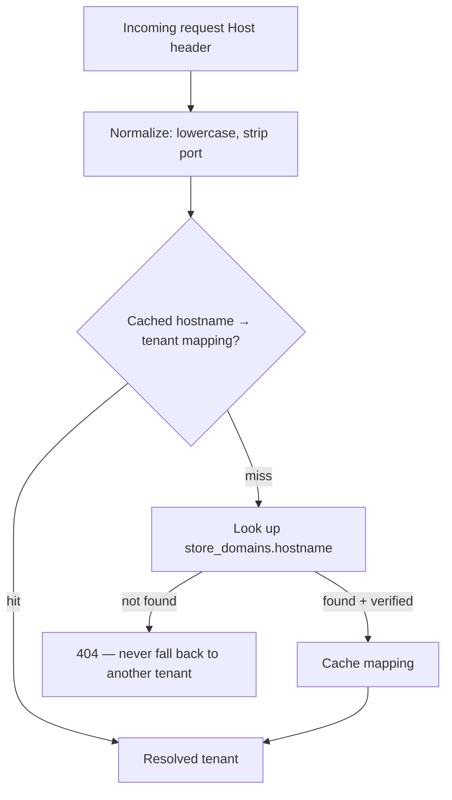

# Multi-Tenancy

Status: design reference — `TenantContext`, hostname resolution, and
tenant-scoped middleware ship in Phase 1. This document defines the model
that phase implements against.

## 1. Model

Shared database, shared schema. One Laravel application, one PostgreSQL
database, every tenant-owned table carries `tenant_id`. There is no
per-tenant database, schema, or deployment — see `docs/DECISIONS.md` for why.

## 2. Hostname Resolution (Public Storefront)

Rules:

- The Host header is normalized (lowercase, port stripped, `www` handled
  consistently) before lookup.
- A hostname resolves to **at most one** tenant. There is no fallback tenant
  and no "closest match" — an unresolved hostname is a 404, never a silent
  fallback to some default tenant.
- Successful hostname → tenant mappings are cached; the cache is invalidated
  whenever a `store_domains` row changes (added, verified, removed, made
  primary).
- Subdomains (`dapur-ibu.usaharumahan.id`) and verified custom domains
  (`www.dapuribu.com`) resolve through the same `store_domains` table and the
  same code path — a custom domain is not a special case.

## 3. Dashboard Tenant Selection

The dashboard is not resolved by hostname (an owner may manage multiple
tenants from the same `dashboard.usaharumahan.id` host). Instead:

1. The authenticated `user` is loaded.
2. Their `tenant_memberships` are checked for the tenant referenced by the
   current session's "selected tenant" (or the only membership if there's
   exactly one).
3. The membership must be active — an owner/staff removed from a tenant
   loses access immediately, not just from the UI but from every
   tenant-scoped query and policy check.

## 4. `TenantContext`

A request-scoped service (bound as a singleton per request, not per
application boot) responsible for:

- Holding the currently resolved tenant for the request.
- Failing loudly (throwing, not silently returning null) when tenant-scoped
  code runs without a resolved tenant.
- Exposing whether the current request is running in platform-admin context
  (which intentionally bypasses tenant scoping, see below).
- Being immutable for the lifetime of a request — nothing switches the
  resolved tenant mid-request.

## 5. Tenant-Scoped Queries

Defense in depth, every layer independently enforcing the boundary so a bug
in any single layer doesn't leak data:

1. **Middleware** resolves the tenant before the controller runs (hostname
   for storefront routes, membership for dashboard routes) and aborts if it
   can't.
2. **Explicit `tenant_id` constraints** in every tenant-scoped query —
   Eloquent global scopes are used as a second layer, not the only layer, so
   a query that accidentally bypasses the global scope (e.g. via
   `withoutGlobalScope`) still can't cross tenants by accident.
3. **Route model binding** resolves models through a tenant-scoped query,
   so `/dashboard/products/{product}` 404s (not 403s — no confirmation that
   the ID exists at all) for a product belonging to another tenant.
4. **Policies** re-verify membership/ownership independently of the query
   scoping, so authorization doesn't rely solely on "the query couldn't have
   returned it."
5. **Database uniqueness constraints** include `tenant_id` (see
   `docs/DATABASE.md`), so even a bug that skips every application-layer
   check can't silently create a global collision.
6. **Cross-tenant automated tests** assert the negative case directly (see
   `docs/TESTING.md`) rather than only testing the happy path.

`tenant_id` is **never** trusted from request input (form fields, query
strings, JSON bodies). It is always derived from `TenantContext`.

## 6. Authorization Model

Roles: `platform_admin`, `owner`, `staff` (enum-backed, see
`docs/DECISIONS.md`). Customers do not authenticate for the MVP — checkout is
guest-first.

Authorization is implemented with Laravel Policies backed by membership
checks, not scattered role-string comparisons in controllers or React
components. A policy method answers "can this user do X to this specific
model," and always re-checks tenant membership rather than trusting that the
model was already tenant-scoped by the query that fetched it.

## 7. Platform-Admin Bypass

Platform admins are the one case allowed to see across tenants (tenant list,
suspend/reactivate, aggregate metrics). This bypass is:

- **Explicit**: routed through separate `PlatformAdmin` controllers under a
  distinct authorization gate, never a side effect of an owner/staff policy
  returning true.
- **Audited**: every platform-admin action that changes state is written to
  `audit_logs` with the actor and the affected tenant.
- Never a global toggle that quietly disables tenant scoping for a whole
  request — it is scoped to the specific platform-admin routes/policies.

## 8. Cross-Tenant Testing Strategy

For every tenant-owned resource (products, categories, inventory, orders,
customers, vouchers, domains, uploaded files), the test suite proves the
negative directly: create the resource under tenant A, authenticate as a
member of tenant B, and assert the request fails (404 for direct-object
access via route binding, 403 where the object's existence is otherwise
visible). These live alongside the resource's feature tests rather than in
one generic "tenancy" test file, so a regression in any module's scoping is
caught next to that module's other tests.
